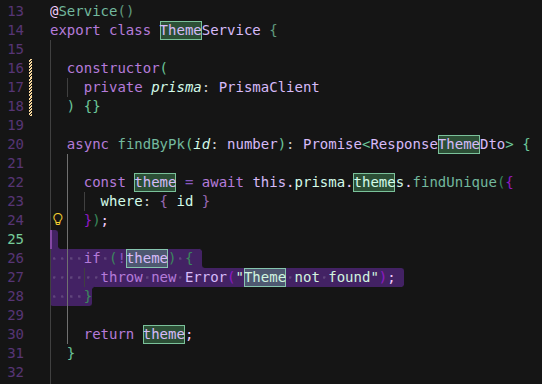
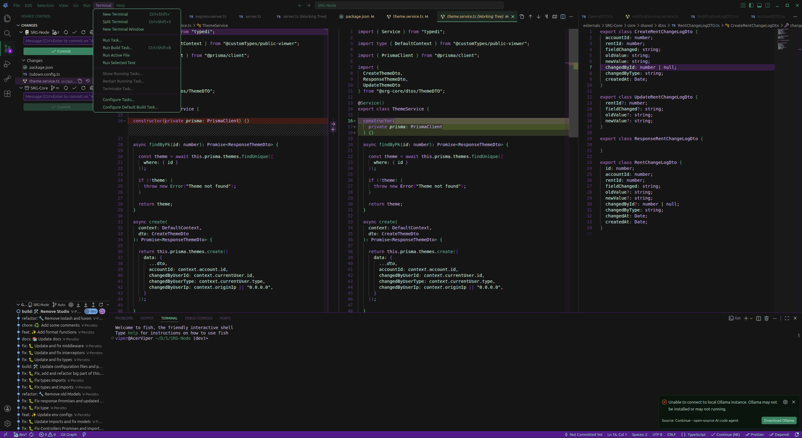

<h1 align="center">Grape Glass Theme</h1>

<h2 align="center">What inspired this theme</h2>
<h3 align="center">My Keyboard</h3>

<h2 align="center">VSCodium Example</h2>
<h3 align="center">Zoomed</h3>

<h3 align="center">Principal</h3>

## Important

If you have problems using this theme, open a [Issue](https://github.com/V-Perotto/Grape-Glass-Theme/issues/new) and send me a screenshot to analyse your request (check if there is an extension that may be causing these issues)

## Author:

[@V-Perotto](https://github.com/V-Perotto)
