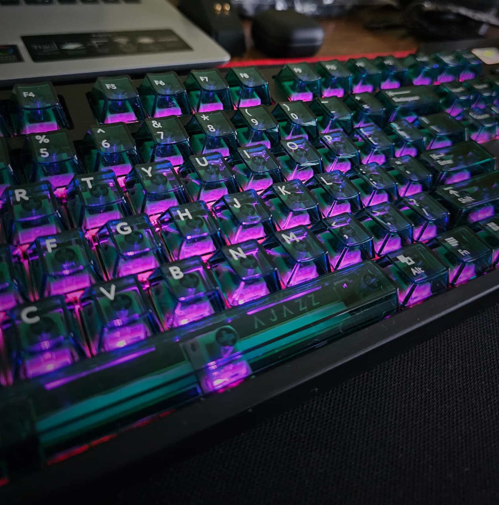
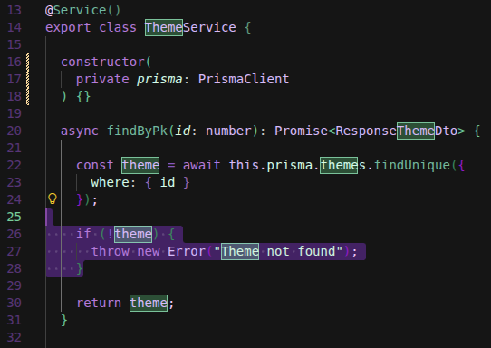
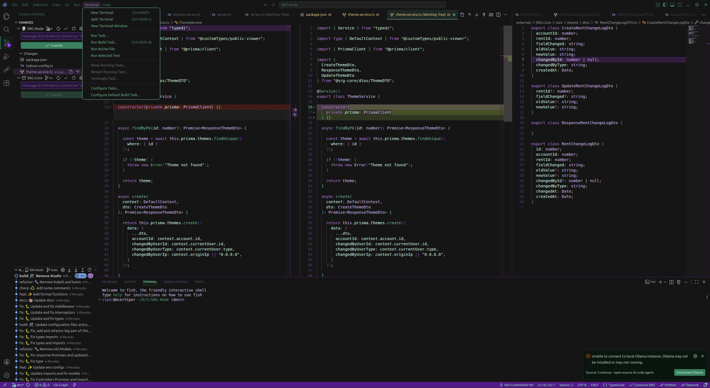

<h1 align="center">Grape Glass Theme</h1>

 

  

<h1 align="center">🥳 Thank You ALL for more than 1K Downloads!</h1>

<h2 align="center">What inspired this theme</h2>
<h3 align="center">My Keyboard</h3>

  I really liked the buttons colors and transparency with light effects.

<h2 align="center">VSCodium Theme - Screenshots</h2>

  Then I thought: <i>"Why not match it with my keyboard?"</i>

<h3 align="center">Zoomed</h3>

<h3 align="center">Principal</h3>

## Important

If you have problems using this theme, open a [Issue](https://github.com/V-Perotto/Grape-Glass-Theme/issues/new) and send me a screenshot to analyse your request (check if there is an extension that may be causing these issues)

  Created by <a href="https://github.com/V-Perotto">V-Perotto</a> and published on <a href="https://open-vsx.org/namespace/DistroLinux">Open VSX - DistroLinux</a> with <a href="http://opensource.org/licenses/MIT">MIT  © Licence</a> 

